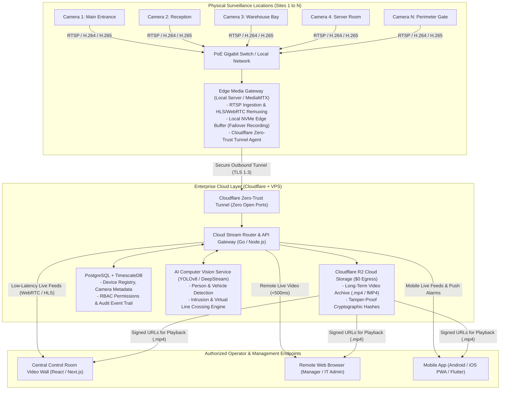
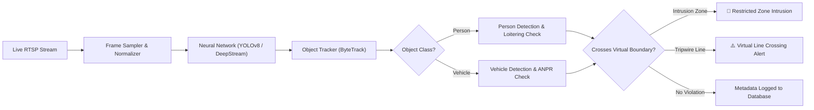
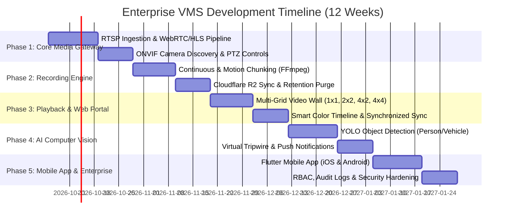

# 🛡️ Enterprise Video Management System (VMS) — Comprehensive Implementation Plan

An industry-grade, developer-friendly blueprint for designing, architecting, and deploying a scalable, cloud-connected **Video Management System (VMS)**. This plan covers core fundamentals, centralized multi-camera and multi-location management, high-performance live monitoring, timeline-based recording & playback, AI video analytics, remote internet access, role-based security, and enterprise scaling (from 10 to 100+ cameras).

---

## 📑 Table of Contents
1. [Core Fundamentals: What is a VMS?](#1-core-fundamentals-what-is-a-vms)
2. [VMS vs Basic CCTV Camera Software](#2-vms-vs-basic-cctv-camera-software)
3. [Industry Applications & Real-World Use Cases](#3-industry-applications--real-world-use-cases)
4. [Complete End-to-End System Architecture & Data Flow](#4-complete-end-to-end-system-architecture--data-flow)
5. [Camera Connectivity & Protocol Standards](#5-camera-connectivity--protocol-standards)
6. [Centralized & Multi-Camera Monitoring Architecture](#6-centralized--multi-camera-monitoring-architecture)
7. [Live Video Wall & Full-Screen Focus Modes](#7-live-video-wall--full-screen-focus-modes)
8. [Recording, Smart Timeline & Video Playback Engine](#8-recording-smart-timeline--video-playback-engine)
9. [Secure Remote Monitoring & Internet Access Architecture](#9-secure-remote-monitoring--internet-access-architecture)
10. [AI Computer Vision & Video Analytics Engine](#10-ai-computer-vision--video-analytics-engine)
11. [User Management, Role-Based Access Control (RBAC) & Camera Permissions](#11-user-management-role-based-access-control-rbac--camera-permissions)
12. [Multi-Location & Enterprise Multi-Site CCTV Management](#12-multi-location--enterprise-multi-site-cctv-management)
13. [Scalability Blueprint: Designing for 10 Cameras vs 100+ Cameras](#13-scalability-blueprint-designing-for-10-cameras-vs-100-cameras)
14. [Key Features & Benefits Checklist](#14-key-features--benefits-checklist)
15. [Recommended Tech Stack](#15-recommended-tech-stack)
16. [Phase-by-Phase Developer Implementation Roadmap](#16-phase-by-phase-developer-implementation-roadmap)

---

## 1. Core Fundamentals: What is a VMS?

### 📌 Definition
**VMS** stands for **Video Management System**. It is a centralized software platform designed to **monitor, manage, record, search, analyze, and control** multiple CCTV cameras and surveillance devices from a single unified interface.

Rather than managing cameras independently through standalone mobile apps or separate web consoles, a VMS aggregates video streams, telemetry, events, and configuration across multiple cameras and physical locations into one coordinated management environment.

```
┌────────────────────────────────────────────────────────────────────────┐
│                        WHAT A VMS BRINGS TOGETHER                      │
│                                                                        │
│   [Cameras] + [Live Feeds] + [Recording] + [Playback] + [Users]        │
│          + [Permissions] + [AI Analytics] + [Remote Access]            │
│                     + [Multi-Site Infrastructure]                      │
│                                                                        │
│        ═══════════════════════════════════════════════════════         │
│          VMS = Centralized Software for Monitoring, Recording,         │
│             Analyzing, and Controlling Surveillance at Scale           │
└────────────────────────────────────────────────────────────────────────┘
```

### 📌 More Than a CCTV Viewer
A common misconception is that a VMS is merely a video player or CCTV monitor. In reality, a VMS is the **central operational intelligence and governance layer** of a physical security infrastructure:
* **Aggregation:** Bridges disparate camera brands, resolutions, codecs (H.264, H.265), and protocols (RTSP, ONVIF) into standard web-compatible protocols.
* **Storage Pipeline:** Segments, encrypts, indexes, and archives footage to local edge NVMe drives and cloud object storage (Cloudflare R2).
* **Intelligence Layer:** Ingests live video frames into deep learning pipelines to detect people, vehicles, intrusions, and line crossings without manual guard fatigue.
* **Audit & Compliance:** Enforces role-based permissions, logs every operator action, and cryptographically signs exported video clips for courtroom admissibility.

---

## 2. VMS vs Basic CCTV Camera Software

Standalone IP cameras or consumer NVRs typically ship with basic viewing software (or mobile apps). While sufficient for 2–4 home cameras, they fail in business and enterprise environments.

| Capability | Basic Camera Software (Consumer Apps) | Enterprise Video Management System (VMS) |
| :--- | :--- | :--- |
| **Vendor Compatibility** | Locked to a single brand (e.g., Dahua-only, Hikvision-only, CP Plus-only) | **Universal:** Connects any ONVIF Profile S/G/T or RTSP IP camera/DVR across brands |
| **Scale & Capacity** | 4 to 8 cameras max before performance degrades | **Scalable:** Architected for 10, 50, 100, to 1,000+ cameras across multiple recording servers |
| **Site Management** | Single location only; switching sites requires logging out | **Centralized Multi-Site:** Unifies Delhi, Mumbai, Bangalore, Dubai branches in one view |
| **Live Grid Flexibility**| Fixed 2x2 grid; sluggish rendering over browser | **Dynamic Layouts:** 1x1, 2x2, 4x2, 3x3, 4x4 with dual-streaming (sub-stream for multi-grid) |
| **Search & Investigation**| Slow linear video seeking; no event timeline markers | **Smart Timeline:** Instant date/time jump, color-coded AI event bars, multi-camera synchronized sync |
| **User & Access Control**| Single shared login; everyone sees every camera | **Granular RBAC:** Per-camera view/control rights (e.g., block guards from Server Room/Director's office) |
| **Remote Access Security**| Risky port-forwarding on router (exposed to botnet scans) | **Zero-Trust Tunnels:** End-to-end encrypted WebRTC/TLS without opening any public firewall ports |
| **Storage Architecture**| Single local HDD (if disk crashes, all evidence is lost) | **Hybrid Failover:** Local edge recording buffer + automated zero-egress cloud sync (Cloudflare R2) |
| **Intelligent Analytics**| Basic pixel/PIR motion triggers (leaves/shadows trigger alarms)| **Neural Vision:** Deep learning classification for Person, Vehicle, Intrusion, and Line Crossing |

---

## 3. Industry Applications & Real-World Use Cases

Centralized VMS management provides operational oversight across critical industries:

* **Offices & Corporate Buildings:** Monitor entrance lobbies, verify visitor badges, restrict server room access, and maintain emergency corridor visibility.
* **Factories & Manufacturing:** Track production line safety, enforce safety equipment compliance, monitor forklift traffic lanes, and protect perimeter boundaries.
* **Warehouses & Logistics:** Monitor loading docks, track inventory movement, detect unauthorized night-time access, and investigate damaged package claims.
* **Shopping Malls & Retail:** Monitor customer density, prevent shoplifting, track entry/exit points, and resolve cashier register discrepancies.
* **Hospitals & Healthcare:** Safeguard emergency triage entries, protect sensitive pharmacy/drug lockers, and monitor ICU corridors without disturbing patients.
* **Schools, Colleges & Universities:** Monitor perimeter gates, track parking lots, and enable instant full-screen lock on incident locations during emergencies.
* **Hotels & Hospitality:** Monitor guest reception, luggage drop zones, kitchen hygiene areas, and perimeter entry doors.
* **Banks & Financial Institutions:** Provide synchronized multi-camera tracking around vault doors, cash counters, and ATM booths with immutable audit logging.
* **Government & Critical Infrastructure:** High-security facilities requiring encrypted video streams, air-gapped options, and strict role segregation.
* **Multi-Location Businesses:** Retail chains and corporate branches managed from a single central Security Operations Center (SOC).

---

## 4. Complete End-to-End System Architecture & Data Flow

### 🏗️ Architectural Flow Diagram



### 🔄 The 5-Step Operational Pipeline
1. **Ingestion:** Cameras transmit compressed video packets (H.264/H.265) via standard RTSP/ONVIF over the local Ethernet network to the Edge Gateway.
2. **Remuxing & Local Buffering:** The Edge Gateway (MediaMTX/go2rtc) converts RTSP into web-ready formats (fMP4 HLS / WebRTC) while writing continuous chunks to local storage.
3. **Encrypted Transport:** Outbound-only Cloudflare Tunnels forward streams to the cloud management layer without opening any inbound ports on the local router.
4. **AI & Event Processing:** Background AI workers analyze incoming frames, triggering alerts when people, vehicles, or virtual tripwires are crossed.
5. **Client Presentation:** The operator views live camera feeds, seeks through historical timelines, or inspects triggered alarms through responsive desktop and mobile dashboards.

---

## 5. Camera Connectivity & Protocol Standards

A professional VMS must remain vendor-agnostic by adhering to established networking protocols:

```
[ IP Camera / DVR / NVR ]
           │
           ├── RTSP (Port 554) ────────► Carries raw compressed H.264/H.265 video packets
           ├── ONVIF (Port 80/8000) ───► Standardized device discovery, PTZ, audio, edge info
           ├── HTTP / WebSocket ───────► Device configuration and event subscriptions
           └── WebRTC / HLS ───────────► Browser-friendly delivery for low-latency playback
```

1. **RTSP (Real-Time Streaming Protocol - RFC 2326):**
   * Standardized connection string format:
     `rtsp://<username>:<password>@<camera_ip>:554/cam/realmonitor?channel=1&subtype=0`
   * `subtype=0` represents the primary high-definition **Main-stream** (1080p / 4K).
   * `subtype=1` represents the lightweight **Sub-stream** (VGA / 360p) for multi-camera grids.
2. **ONVIF Profiles (Open Network Video Interface Forum):**
   * **Profile S:** Basic video streaming, PTZ (Pan/Tilt/Zoom) control, and audio inputs.
   * **Profile G:** Edge recording configuration, onboard SD card search, and playback.
   * **Profile T:** Modern video compression (H.265), analytics events, and two-way audio talkback.
3. **WebRTC & Low-Latency HLS:**
   * Browsers cannot play raw RTSP. The VMS gateway transforms RTSP into **WebRTC** (for sub-500ms live video) or **Low-Latency fMP4 HLS** (with hardware H.265 acceleration in modern Chrome/Edge).

---

## 6. Centralized & Multi-Camera Monitoring Architecture

### 📌 The Need for Centralization
Managing 10 to 100+ cameras individually causes severe operational fatigue. A VMS creates a single operational plane where all cameras are organized logically.

### 📌 Concrete Camera Mapping Example
In a facility surveillance setup, an operator can monitor diverse zones simultaneously on one screen:

```
┌─────────────────────────────────┬─────────────────────────────────┐
│ Camera 1: Main Entrance Gate    │ Camera 2: Reception Lobby       │
│ Resolution: 1080p | 25 FPS      │ Resolution: 1080p | 25 FPS      │
├─────────────────────────────────┼─────────────────────────────────┤
│ Camera 3: Parking Area & Ramps  │ Camera 4: Warehouse Loading Bay │
│ Resolution: 1080p | 25 FPS      │ Resolution: 1080p | 25 FPS      │
├─────────────────────────────────┼─────────────────────────────────┤
│ Camera 5: Server Room & IT Rack │ Camera 6: Back Perimeter Gate   │
│ Resolution: 1080p | 25 FPS      │ Resolution: 1080p | 25 FPS      │
├─────────────────────────────────┼─────────────────────────────────┤
│ Camera 7: Production Assembly   │ Camera 8: Executive Office Floor│
│ Resolution: 1080p | 25 FPS      │ Resolution: 1080p | 25 FPS      │
└─────────────────────────────────┴─────────────────────────────────┘
```

### 📌 Logical Device Hierarchy
Cameras should be structured hierarchically within the VMS database:
```
Organization (e.g. Enterprise Global Corp)
  └── Region / City (e.g. India - North)
        └── Site / Facility (e.g. Delhi Warehouse 01)
              └── Zone / Building (e.g. Main Logistics Building)
                    └── Floor / Area (e.g. Ground Floor - Inbound Dock)
                          └── Camera Device (e.g. Cam 04 - Dock Door B)
```

---

## 7. Live Video Wall & Full-Screen Focus Modes

### 📌 Multi-Grid Viewing Modes
The VMS video wall accommodates different operational requirements with customizable screen splits:
* **1x1 Single Focus View:** Dedicated investigation of a single camera with full bitrate and resolution.
* **2x2 Quad View (4 Cameras):** Balanced view for small offices, branches, or retail shops.
* **4x2 Layout (8 Cameras):** Tailored for standard 8-channel DVR/NVR commercial systems without empty grid slots.
* **3x3 View (9 Cameras):** Mid-sized facilities and floor management.
* **4x4 View (16 Cameras):** Comprehensive security operations control room layout.
* **5x5 / 6x6 View (25–36 Cameras):** High-density video wall installations supported by GPU hardware acceleration.

```
       [ 1x1 Focus ]               [ 2x2 Quad (4) ]               [ 4x2 Layout (8) ]
   ┌───────────────────┐       ┌─────────┬─────────┐       ┌─────┬─────┬─────┬─────┐
   │                   │       │  CAM 1  │  CAM 2  │       │  1  │  2  │  3  │  4  │
   │       CAM 1       │       ├─────────┼─────────┤       ├─────┼─────┼─────┼─────┤
   │    (Full 1080p)   │       │  CAM 3  │  CAM 4  │       │  5  │  6  │  7  │  8  │
   └───────────────────┘       └─────────┴─────────┘       └─────┴─────┴─────┴─────┘
```

### 📌 Dual-Streaming Optimization
Running 16 high-definition (4K / 1080p) streams simultaneously will crash standard browser engines and saturate office bandwidth:
* **Grid Display (Multi-Cam):** The VMS automatically pulls the camera's **Sub-Stream** (640×360 or D1 @ 15fps, ~512 kbps). Sixteen cameras consume only ~8 Mbps total.
* **Full-Screen Maximize (Single-Cam):** When the operator double-clicks any tile to maximize it, the VMS seamlessly switches to the high-bitrate **Main-Stream** (1080p / 4K @ 25fps, ~4096 kbps) for crisp forensic investigation.

### 📌 Full-Screen Focus Trigger Flow
```
[ Operator Monitors 16-Cam Grid (Sub-Streams) ]
                    │
                    ▼ (Operator spots suspicious movement on Camera 7)
[ Double-Click or Select Camera 7 ]
                    │
                    ▼
[ VMS Instantly Switches Camera 7 to 1x1 Full-Screen ]
                    │
                    ├── Request Main-Stream (Full HD / 4K Bitrate)
                    ├── Activate PTZ Controls & Optical Zoom
                    └── Enable Real-Time Forensic Audio Intercom
```

### 📌 On-Screen Display (OSD) Guidelines
* **Camera Title:** Positioned on the top-left (`CAM 01 • Main Entrance`). Truncate with an ellipsis to prevent multi-line wrapping on small grid cards.
* **Status Badges:** Compact micro-badges for `AI ACTIVE` and `REC` grouped alongside the title.
* **Hardware Timestamp Protection:** Never place UI elements in the top-right corner, as physical CCTV cameras place their factory date/time stamps there.
* **Telemetry Bar:** Compact single-line telemetry on the bottom (`25 FPS • 4Mbps • SUB`) paired with clean `HH:MM:SS` live time.
* **Aspect Ratio & Sharpness:** Support `object-fit: fill` (to eliminate black side-bars on 1080N anamorphic feeds) and `image-rendering: -webkit-optimize-contrast` for razor-sharp text and edge contrast.

---

## 8. Recording, Smart Timeline & Video Playback Engine

Surveillance is only as effective as the ability to retrieve past footage quickly during an incident investigation.

### 📌 Recording Strategies
1. **Continuous 24/7 Recording:** Every second is captured into 60-second `.mp4` chunks. Provides complete certainty at the expense of higher storage utilization.
2. **Motion / AI Event-Triggered Recording:** The system only records when people, vehicles, or motion are detected, reducing storage consumption by 70–80%.
3. **Pre-Alarm & Post-Alarm Ring Buffering:**
   * An in-memory ring buffer keeps **5 to 10 seconds of video prior to the event**.
   * If a perimeter breach occurs at `03:30:00 PM`, the saved clip includes footage starting from `03:29:50 PM` so operators see the suspect's approach.
   * Recording continues for 30 seconds after motion ceases.

### 📌 Timeline-Based Video Search Architecture
Instead of downloading gigabytes of video to find an incident, the VMS provides an interactive, visual smart timeline:

```
[ Date Picker: Oct 4, 2026 ] ──► [ Camera: Cam 01 (Entrance) ] ──► [ Hour: 15:00 to 16:00 ]
                                         │
                                         ▼
Timeline Scrub Bar (15:00 ────────────────────────────────────────── 16:00)
                    [  Green: 24/7 Footage  ][ Red: AI Intrusion ][ Green ]
                                                  ▲
                                             (Scrub Needle)
```

1. **Date & Time Selectors:** Operators select the target date (e.g. October 2), start time (e.g. 08:45 PM), and duration.
2. **Color-Coded Timeline Navigation:**
   * **Green segments:** Continuous normal footage.
   * **Red segments:** AI-detected alarms (Person, Vehicle, Line Crossing).
   * **Blue / Yellow segments:** User bookmarks or manual incident markers.
3. **Comprehensive VCR Playback Controls:**
   * **Standard Play / Pause**
   * **Multi-Speed Fast Forward:** 0.5x, 1x, 2x, 4x, 8x, 16x, 32x.
   * **Frame-by-Frame Step:** Precise millisecond investigation for vehicle license plates or facial shots.
   * **Multi-Camera Synchronized Playback:** Play up to 4 cameras simultaneously at the identical timestamp to trace a suspect moving across rooms.
4. **Tamper-Proof Video Exporter:**
   * Clip extraction tool with **cryptographic SHA-256 digital signature**.
   * Burned-in OSD timestamp watermarks ensure the exported `.mp4` file is admissible as legal evidence in court.

---

## 9. Secure Remote Monitoring & Internet Access Architecture

### 📌 Remote Monitoring Requirements
Authorized personnel must be able to view camera feeds remotely across laptops, tablets, and smartphones (iOS & Android) without being tied to the physical facility.

```
┌─────────────────┐       ┌─────────────────┐       ┌──────────────────────┐
│  Office / Site  │       │ Cloudflare Edge │       │ Authorized User Device│
│   CCTV System   │ ────► │  Encrypted R2   │ ────► │  - Laptop Browser     │
│ (Behind Router) │       │   Zero-Trust    │       │  - Mobile App / Tablet│
└─────────────────┘       └─────────────────┘       └──────────────────────┘
         ▲                                                     ▲
         └───────────── Encrypted WebSocket / WebRTC ──────────┘
```

### 📌 Mitigating Remote Cybersecurity Risks
Traditional CCTV remote setups rely on **router port-forwarding (opening port 554 or 80)**. This exposes cameras directly to public internet scans, brute-force attacks, and botnets (e.g. Mirai).

**Enterprise VMS Zero-Trust Approach:**
1. **No Inbound Open Ports:** The local Edge Gateway initiates an outbound-only TLS 1.3 tunnel (Cloudflare Tunnel) to the cloud relay. The router firewall remains completely closed.
2. **Ephemeral Signed Streaming Tokens:** Video streams cannot be viewed via raw URLs. Client requests receive time-limited (e.g. 60-second) cryptographic tokens tied to the user's session.
3. **End-to-End Encryption:** Video is transmitted over **SRTP / TLS 1.3** and stored at rest using **AES-256**.
4. **Adaptive Bitrate Streaming (ABR):** Automatically throttles stream bitrate if a mobile client experiences fluctuating cellular coverage (4G/5G).

---

## 10. AI Computer Vision & Video Analytics Engine

A modern VMS transforms passive camera feeds into active, automated alerting systems using Computer Vision.



### 📌 Core AI Analytical Modules

#### 1. Person Detection
* Identifies human forms within the camera view while filtering out false triggers caused by shadows, swaying trees, rain, or small animals.
* Applications: Monitoring server rooms after hours, empty warehouse floors, and emergency exit routes.

#### 2. Vehicle Detection
* Identifies and tracks cars, trucks, motorcycles, and forklifts entering the camera frame.
* Applications: Monitoring parking entries, warehouse loading docks, and factory vehicle pathways.

#### 3. Intrusion Detection (Zone Breach)
* Operators draw a virtual polygon on the live camera view defining a restricted security zone.
* If an authorized target (e.g. a Person or Vehicle) steps inside that zone during configured hours (e.g., 10:00 PM – 06:00 AM), the VMS immediately sounds a siren and dispatches push alerts.

#### 4. Line Crossing Detection (Virtual Tripwire)
* Operators draw a directional line (A ➔ B, B ➔ A, or Both) across a pathway (e.g. a gate or warehouse boundary).
* Generates an event specifically when an object crosses the threshold in the monitored direction, eliminating false alarms from people moving within permitted areas.

#### 5. Additional Advanced Analytics (Extensible Modules)
* **Loitering Detection:** Triggers an alert if an individual remains stationary inside an area longer than a threshold (e.g., > 90 seconds near an ATM or vault).
* **Automatic Number Plate Recognition (ANPR):** Extracts vehicle license plate numbers, checking them against whitelists (automatic gate open) and blacklists.
* **Crowd Density & Overcrowding:** Monitors assembly points and fire exits for hazardous crowd build-up.

---

## 11. User Management, Role-Based Access Control (RBAC) & Camera Permissions

In business environments, unrestricted camera access is a major compliance and privacy violation. A VMS provides strict user segregation.

### 📌 Role Archetypes & Responsibilities
1. **Super Administrator:** Full access to all sites, camera additions/deletions, system settings, user creation, and audit logs.
2. **Branch / Facility Manager:** Access to live viewing, recording search, and PTZ controls strictly within their assigned facility.
3. **Security Operator / Guard:** Monitored live viewing and PTZ control on designated cameras; restricted from exporting video or viewing administrative areas.
4. **Compliance Auditor / Investigator:** Read-only access to historical playback and tamper-proof exports; no live camera control or configuration permissions.

### 📌 Granular Permission Matrix

| User Role | Live Monitoring | PTZ Joystick | Timeline Playback | Video Export | System Settings | User Management |
| :--- | :---: | :---: | :---: | :---: | :---: | :---: |
| **Super Admin** | ✅ All Sites | ✅ Full Priority | ✅ All Cameras | ✅ Tamper-Proof | ✅ Yes | ✅ Yes |
| **Branch Manager** | ✅ Assigned Site | ✅ Normal Priority | ✅ Assigned Site | ✅ With Watermark | ❌ No | ❌ No |
| **Security Guard** | ✅ Assigned Cams | ⚠️ View-only PTZ | ❌ No Playback | ❌ No Export | ❌ No | ❌ No |
| **Auditor / Legal** | ❌ No Live View | ❌ No PTZ | ✅ Assigned Range | ✅ Cryptographic | ❌ No | ❌ No |

### 📌 Camera-Level Restriction Example
Even within the same physical office, individual camera permissions must be enforce-able per employee:

```
┌───────────────────────────────┬───────────────────────────────┐
│ Security Employee A (Gate)    │ Security Employee B (HQ SOC)  │
├───────────────────────────────┼───────────────────────────────┤
│ ✅ Main Entrance Gate          │ ✅ Main Entrance Gate          │
│ ✅ Parking Area & Perimeter   │ ✅ Parking Area & Perimeter   │
│ ✅ Reception Area             │ ✅ Reception Area             │
│ ❌ HR Office (BLOCKED)        │ ❌ HR Office (BLOCKED)        │
│ ❌ Executive Suite (BLOCKED)  │ ❌ Executive Suite (BLOCKED)  │
│ ❌ Server Room (BLOCKED)      │ ✅ Server Room (AUTHORIZED)   │
└───────────────────────────────┴───────────────────────────────┘
```

### 📌 Immutable Audit Trails
The VMS logs every operator action to prevent evidence tampering and internal misuse:
* Operator identity, IP address, and timestamp.
* Exact camera viewed or exported.
* Recording timeframe accessed during an investigation.

---

## 12. Multi-Location & Enterprise Multi-Site CCTV Management

For organizations operating across multiple buildings, cities, or countries, managing CCTV independently at each branch is inefficient. A centralized VMS consolidates geographically separated sites into one unified operations dashboard.

### 📌 Multi-Site Topology Diagram

```
                 ┌────────────────────────────────────────────────────────┐
                 │       CENTRAL ENTERPRISE VMS CLOUD PLATFORM            │
                 │        (Global Security Operations Center)             │
                 └──────────────────────────┬─────────────────────────────┘
                                            │
        ┌───────────────────┬───────────────┴───────────────┬───────────────────┐
        │                   │                               │                   │
        ▼                   ▼                               ▼                   ▼
┌───────────────┐   ┌───────────────┐               ┌───────────────┐   ┌───────────────┐
│ Delhi Office  │   │ Mumbai Branch │               │ Bangalore Hub │   │ Dubai Branch  │
│ 16 IP Cameras │   │ 24 IP Cameras │               │ 32 IP Cameras │   │ 8 IP Cameras  │
│ Edge Gateway  │   │ Edge Gateway  │               │ Edge Gateway  │   │ Edge Gateway  │
└───────────────┘   └───────────────┘               └───────────────┘   └───────────────┘
```

### 📌 Key Advantages of Multi-Site Centralization
1. **Single Pane of Glass:** Security leadership can monitor Delhi, Mumbai, Bangalore, and international sites simultaneously from one screen.
2. **Centralized Incident Response:** If an intrusion alert fires in the Bangalore warehouse at night, central headquarters security can view the live feed and dispatch local emergency responders.
3. **Unified User Accounts:** Employees can be granted access to specific cameras across multiple locations without creating separate accounts on multiple local NVRs.
4. **Standardized Compliance Policies:** Backup retention policies (e.g. 30-day auto-purge) and encryption rules are enforced universally from the central console.

---

## 13. Scalability Blueprint: Designing for 10 Cameras vs 100+ Cameras

A VMS architecture must scale predictably. Merely having VMS software does not guarantee it can handle hundreds of cameras without proper hardware, network, and storage sizing.

### 📌 Comparison: 10-Camera Setup vs 100+ Camera Enterprise Deployment

| Architecture Dimension | Small Deployment (10 Cameras) | Enterprise Deployment (100+ Cameras) |
| :--- | :--- | :--- |
| **Typical Environment** | Retail shop, restaurant, small office, home villa | Commercial mall, university campus, factory, logistics hub |
| **Edge Server Hardware** | Mini PC / Intel N100 / 8GB RAM / 1TB SSD | Dedicated 1U/2U Rack Servers (Xeon/EPYC, 64GB RAM, NVMe arrays) |
| **Media Gateway Layer** | Single MediaMTX instance on edge PC | Clustered MediaMTX / go2rtc instances behind load balancers |
| **Network Infrastructure** | Standard Gigabit unmanaged PoE switch | Managed PoE+ L2/L3 switches with VLAN segmentation for CCTV traffic |
| **Bandwidth Requirement**| ~20–30 Mbps LAN; 10 Mbps WAN upload | ~300–500 Mbps dedicated LAN backbone; 100+ Mbps redundant WAN |
| **Storage Architecture** | Local SSD + direct Cloudflare R2 sync | Tiered storage: Local NVMe buffer (7 days) + R2 Hot Archive (30-90 days) |
| **AI Analytics Compute** | CPU-based inference (YOLO-nano @ 5 FPS) | Dedicated GPU accelerators (Nvidia T4 / A2 / RTX 4000) with TensorRT |
| **User Concurrency** | 1 to 3 simultaneous operators | 20 to 50+ concurrent guards, managers, and remote auditors |

### 📌 Sizing Formulas for Engineers
1. **Network Throughput Formula:**
   $$\text{Total Bandwidth (Mbps)} = N \times \text{Bitrate per Camera}$$
   * Example (100 Cameras @ 4 Mbps H.265): $100 \times 4\text{ Mbps} = 400\text{ Mbps}$ internal LAN throughput.
2. **Storage Capacity Formula:**
   $$\text{Storage (GB/day)} = \frac{\text{Bitrate (kbps)} \times 3600 \times 24}{8 \times 1024 \times 1024} \approx \text{Bitrate (Mbps)} \times 10.55$$
   * At 4 Mbps H.265 continuous recording, one camera uses $\approx 42.2\text{ GB/day}$.
   * 100 cameras require $\approx 4.2\text{ TB/day}$ of storage capacity. Using motion-triggered recording cuts this demand down to $\approx 1\text{ TB/day}$.

---

## 14. Key Features & Benefits Checklist

### ✅ Professional VMS Feature Matrix
* [x] **Centralized Device Management:** Manage all cameras and DVRs across branches from one dashboard.
* [x] **Flexible Live Video Wall:** Dynamic 1x1, 2x2, 4x2 (8-cam), 3x3, and 4x4 screen splits with dual-streaming.
* [x] **Instant 1x1 Focus:** Double-click any camera tile to switch into high-definition focus mode.
* [x] **Smart Timeline Playback:** Color-coded timeline scrub bar with green (normal) and red (alarm) indicators.
* [x] **Date & Time Precise Seek:** Instant navigation to specific timestamps for fast investigation.
* [x] **Synchronized Multi-Camera Playback:** Replay up to 4 cameras simultaneously at the same timestamp.
* [x] **Remote Web & Mobile Access:** Secure streaming to laptops, tablets, and phones without port-forwarding.
* [x] **AI Person Detection:** Neural detection of human presence in restricted areas.
* [x] **AI Vehicle Detection:** Tracking of cars, trucks, and motorcycles at gates and parking lots.
* [x] **Intrusion Detection:** Configurable virtual polygon alarm zones.
* [x] **Line Crossing Detection:** Directional virtual tripwire breach alerts.
* [x] **Role-Based Access Control (RBAC):** Tiered roles (Admin, Manager, Guard, Auditor).
* [x] **Camera-Level Security:** Restrict sensitive feeds (e.g. HR, Server Room, Director's Office).
* [x] **PTZ Control Suite:** Interactive Pan/Tilt/Zoom joystick, preset bookmarks, and automated patrol tours.
* [x] **Two-Way Audio Intercom:** Push-to-talk broadcast through camera loudspeakers.
* [x] **Tamper-Proof Video Export:** Cryptographically hashed (SHA-256) video clips for courtroom compliance.
* [x] **Interactive Architectural E-Maps:** Place camera viewing cones over floor plans with flashing alarm beacons.
* [x] **Cloudflare R2 Integration:** Zero-egress cloud storage economics with rolling retention loops.

---

## 15. Active Project Technology Stack & Developer Requirements

This implementation plan directly maps to the active codebase (**`aegis-vms-app`**). Below is the exact technology stack, libraries, and frameworks currently implemented in this repository, alongside the developer competencies required to extend it.

### 📌 1. Exact Technologies Used in This Project (`aegis-vms-app`)

| Layer / Component | Technology / Library | Version / File Location | Role & Implementation in This Project |
| :--- | :--- | :--- | :--- |
| **Frontend Framework** | **React** | `^19.2.8` (`package.json`) | Component-based UI managing camera feeds, responsive video wall, playback suite, and modals. |
| **DOM Renderer** | **React DOM** | `^19.2.8` (`package.json`) | High-performance virtual DOM rendering with fast reactive state updates. |
| **Build Tool & Dev Server**| **Vite** | `^8.3.0` (`vite.config.js`) | Next-gen lightning-fast dev server with Hot Module Replacement (HMR) and optimized ES module bundling. |
| **Vite React Plugin** | **`@vitejs/plugin-react`** | `^6.1.1` (`package.json`) | Fast JSX compilation and Fast Refresh support in Vite. |
| **Video Player Engine** | **`hls.js`** | `^1.7.3` (`src/components/CameraCell.jsx`) | Hardware-accelerated H.265 / HEVC and H.264 playback inside HTML5 `<video>` tags via Low-Latency fMP4 HLS. Handles auto-recovery and memory cleanup. |
| **UI Iconography** | **`lucide-react`** | `^1.51.0` (`src/components/*`) | Clean, modern surveillance icons for PTZ, cameras, layout grids, shields, and diagnostic sensors. |
| **High-Speed Linter** | **`oxlint`** | `^1.81.0` (`.oxlintrc.json`) | Rust-based ultra-fast linter enforcing code quality and strict syntax hygiene. |
| **Design System & Styling**| **Vanilla CSS3** | `src/index.css` & `src/App.css` | Glassmorphism design system (`--bg-primary: #0a0d14`, `--accent-cyan: #06b6d4`), responsive layout grids (`.grid-1`, `.grid-4`, `.grid-8`, `.grid-9`, `.grid-16`), custom scrollbars, and micro-animations. |
| **Edge Media Gateway** | **MediaMTX** | `mediamtx/mediamtx.exe` | Embedded Go-based RTSP streaming server remuxing CP PLUS DVR streams to HLS on port `8888` and WebRTC on port `8889`. |
| **Gateway Configuration** | **YAML** | `mediamtx/mediamtx.yml` | Sets `sourceOnDemand: no` and `hlsAlwaysRemux: yes` to maintain continuous background caching for instant channel switching. |
| **Process Orchestrator** | **Node.js (ESM)** | `start-all.js` (`"type": "module"`) | Automatically verifies port `8888` availability via `net.Socket`, spawns `mediamtx.exe` in the background, and runs `vite` concurrently with graceful multi-process termination. |
| **DVR & Stream Integration**| **RTSP (TCP)** | Channels 1–8 (`mediamtx.yml`) | Ingests from physical CP PLUS 8-Channel DVR at `192.168.1.2:554` supporting Main-Streams (`subtype=0`) and Sub-Streams (`subtype=1`). |
| **Synthesized Audio System**| **Web Audio API** | `src/services/soundEffects.js` | Pure browser Web Audio API oscillator synthesizing emergency alarm sirens, tripwire alert chimes, and push-to-talk tones without external MP3 files. |
| **Diagnostic Probes** | **Node.js Scripts** | `probe.js`, `scan_dvr_channels.js`, `test_vms.js` | Built-in CLI tools to probe DVR channels, verify RTSP authentication, and test HTTP stream health. |

---

### 📌 2. Frontend Component Architecture in This Project

The frontend application (`src/components/`) is modularized into specialized operational suites:

* **`LiveVideoWall.jsx`**: Central multi-camera monitoring grid supporting dynamic layouts (`1`, `4`, `8`, `9`, `16`) with `localStorage` grid preference persistence and double-click full-screen focus.
* **`CameraCell.jsx`**: Individual HLS video cell with automatic stream recovery, latency monitoring, signal health indicator, aspect-ratio preservation (`object-fit: fill`), and top-left OSD badge positioning.
* **`PlaybackSuite.jsx`**: Historical footage player featuring an interactive color-coded timeline (green continuous / red AI alarms), date/time precise seeking, and multi-speed playback (0.5x to 16x).
* **`AiAnalyticsView.jsx`**: Computer vision center displaying live Person/Vehicle classification logs, bounding-box overlays, virtual intrusion polygon zones, and directional tripwire line controls.
* **`FacilityEMap.jsx`**: Interactive 2D architectural floor plan with camera viewing cones, placement markers, and flashing alarm beacons.
* **`PTZController.jsx`**: 8-directional Pan/Tilt/Zoom joystick with optical zoom step controls and preset position bookmarks.
* **`TwoWayAudioModal.jsx`**: Push-to-talk audio intercom broadcasting operator voice to camera speakers.
* **`CameraHealthDiagnostics.jsx`**: Real-time telemetry monitoring FPS, bitrate, jitter, and dropped frames.
* **`UserManagementModal.jsx`**: Role-Based Access Control (RBAC) manager with camera-level permission assignments (Super Admin, Manager, Guard, Auditor).
* **`CloudflareSettingsModal.jsx`**: Zero-Trust Cloudflare Tunnel configuration and Cloudflare R2 backup settings.
* **`ForensicSearchModal.jsx`**: Forensic investigation modal filtering footage by camera, date, time window, and AI event tags.

---

### 📌 3. Developer Skill Sets & Technical Competencies (This Project Stack)

To build and extend this exact codebase, a developer needs proficiencies in:

```
┌────────────────────────────────────────────────────────────────────────┐
│             CURRENT PROJECT DEVELOPER CORE SKILL SET                   │
├────────────────────────────────────────────────────────────────────────┤
│ 1. React 19 & Vite: Hooks (useState, useEffect, useRef), Fast HMR      │
│ 2. Video Streaming: Hls.js lifecycle, HTML5 <video> hardware HEVC      │
│ 3. Node.js Scripting: ES Modules, child_process.spawn(), net.Socket    │
│ 4. Media Gateway: MediaMTX RTSP-to-HLS remuxing, mediamtx.yml tuning   │
│ 5. Advanced CSS3: CSS Grid, Flexbox, custom design tokens, responsive  │
│ 6. Browser APIs: HTML5 Canvas 2D, Web Audio API, localStorage          │
└────────────────────────────────────────────────────────────────────────┘
```

1. **React 19 & State Management:**
   * Efficient hook usage: managing camera selection state, layout toggles, modal dialogs, and simulated telemetry streams.
   * `localStorage` synchronization: retaining user layout preferences across browser refreshes.
2. **Video Streaming & Hls.js Lifecycle:**
   * Cleanly instantiating `new Hls()`, attaching to video elements, handling `Hls.Events.ERROR` with fatal error recovery, and strictly calling `hls.destroy()` upon cell unmounting to prevent memory exhaustion in multi-grid views.
   * Applying `object-fit: fill` and `-webkit-optimize-contrast` to remove letterbox sidebars and ensure crisp hardware DVR text.
3. **Node.js Process Orchestration:**
   * Working with `start-all.js` to manage multi-process lifecycles: checking port availability (`net.Socket`), spawning daemon binaries (`mediamtx.exe`), and triggering Vite.
4. **MediaMTX Gateway Configuration:**
   * Setting up RTSP camera paths in `mediamtx.yml`, selecting between Main-Stream (`subtype=0`) and Sub-Stream (`subtype=1`), and configuring low-latency HLS parameters (`hlsSegmentDuration`, `hlsPartDuration`).

---

### 📌 4. How to Run This Project Workstation

```bash
# 1. Install dependencies
npm install

# 2. Start both MediaMTX Gateway and Vite Frontend simultaneously
npm run dev

# 3. Code quality inspection
npm run lint

# 4. Production build
npm run build
```

---

---

---

## 16. Phase-by-Phase Developer Implementation Roadmap



### Detailed Sprint Milestones

#### Phase 1: Edge Media Layer & Protocol Ingestion (Weeks 1–3)
* Deploy **MediaMTX** gateway binary with pre-configured RTSP paths.
* Configure continuous RTSP connections (`sourceOnDemand: no`, `hlsAlwaysRemux: yes`) to prevent switching delays.
* Implement browser HLS/WebRTC streaming pipeline supporting H.265 / H.264 codecs.
* Implement ONVIF WS-Discovery probe to auto-detect cameras on the local subnet.

#### Phase 2: Recording Pipeline & Cloudflare R2 Storage (Weeks 4–5)
* Implement stream segmenter producing 60-second `.mp4` chunks.
* Establish pre/post-alarm ring buffer in memory (5s pre-event buffer).
* Connect edge segmenter to **Cloudflare R2** with automated retry queues.
* Implement background rolling retention loop (automatic purging of clips older than 30/60/90 days).

#### Phase 3: Web Portal, Live Video Wall & Smart Timeline (Weeks 6–7)
* Construct responsive video wall supporting 1x1, 2x2, 4x2 (8-cam), 3x3, and 4x4 grid modes with grid state persistence in `localStorage`.
* Implement dual-streaming: load lightweight sub-streams for multi-grid tiles and switch to main-streams upon double-click full-screen focus.
* Develop the interactive timeline scrub bar with green (continuous) and red (alarm) segments.
* Build synchronized quad-camera playback engine and evidence exporter with SHA-256 cryptographic watermarking.

#### Phase 4: AI Computer Vision & Perimeter Rules (Weeks 8–9)
* Deploy lightweight YOLO inference pipeline sampling frames from RTSP streams.
* Implement Person and Vehicle classification.
* Build interactive canvas polygon editor for Intrusion Detection zones and Virtual Tripwire lines.
* Connect tripwire crossing events to real-time audio sirens, UI banner alerts, and WebSocket broadcasts.

#### Phase 5: Mobile App & Enterprise Security Hardening (Weeks 10–12)
* Build cross-platform mobile client (Flutter / PWA) supporting remote camera monitoring, PTZ controls, and push notifications.
* Implement granular Role-Based Access Control (RBAC) with per-camera permission enforcement.
* Enforce signed ephemeral URLs for video streams to prevent unauthorized stream link sharing.
* Conduct failover buffer testing: verify that if WAN internet drops, edge gateways record to local SSDs and automatically reconcile missing clips to Cloudflare R2 once connectivity returns.
