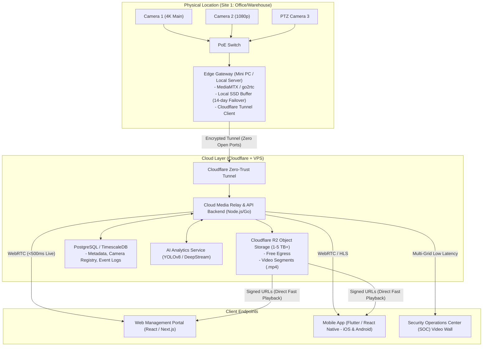
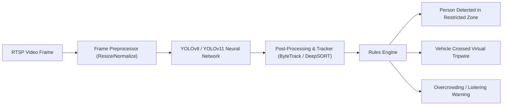

# 🛡️ Enterprise Video Management System (VMS) — Comprehensive Implementation Plan

An industry-ready blueprint for designing, architecting, and deploying a scalable, cloud-connected Video Management System (VMS) supporting live monitoring, recording & playback, AI video analytics, multi-site management, and end-to-end security.

---

## 📑 Table of Contents
1. [Core Fundamentals: What is VMS & How It Works](#1-core-fundamentals-what-is-vms--how-it-works)
2. [VMS vs Basic CCTV Software](#2-vms-vs-basic-cctv-software)
3. [Industry Applications & Real-World Use Cases](#3-industry-applications--real-world-use-cases)
4. [End-to-End System Architecture](#4-end-to-end-system-architecture)
5. [Camera Connectivity & Protocol Standards](#5-camera-connectivity--protocol-standards)
6. [Multi-Camera & Multi-Location Management](#6-multi-camera--multi-location-management)
7. [Live Monitoring & Video Wall Architecture](#7-live-monitoring--video-wall-architecture)
8. [Recording, Storage & Playback Engine (Cloudflare R2)](#8-recording-storage--playback-engine-cloudflare-r2)
9. [Remote Monitoring & Bandwidth Optimization](#9-remote-monitoring--bandwidth-optimization)
10. [AI Video Analytics Engine](#10-ai-video-analytics-engine)
11. [Enterprise Security, Stability & Role-Based Access Control (RBAC)](#11-enterprise-security-stability--role-based-access-control-rbac)
12. [Recommended Tech Stack](#12-recommended-tech-stack)
13. [Phase-by-Phase Implementation Roadmap](#13-phase-by-phase-implementation-roadmap)

---

## 1. Core Fundamentals: What is VMS & How It Works

### ✅ VMS Kya Hai? (What is a Video Management System?)
A **Video Management System (VMS)** is an enterprise software platform that ingests, records, stores, analyzes, and streams video feeds from multiple IP cameras and sensors into a single, unified interface.

Unlike a simple NVR/DVR that just records video to a local hard drive, a VMS provides:
* Centralized live monitoring across multiple sites.
* Advanced search, multi-camera synchronized playback, and export tools.
* Real-time automated alerts based on Computer Vision (AI) and sensors.
* Granular access control, encryption, health monitoring, and cloud backup.

### ✅ Video Management System Kaise Kaam Karta Hai? (How Does It Work?)
```
[ IP Cameras (RTSP/ONVIF) ]
           │
           ▼
[ Edge Media Gateway / Local Agent ] ───► Local Hard Drive (Failover Buffer)
           │ (WebRTC / HLS / TLS Tunnel)
           ▼
[ Cloud Media Server + Cloudflare ] ───► Cloudflare R2 (Encrypted Long-term Storage)
           │
           ├──► [ AI Analytics Worker ] (Person/Vehicle/Line Crossing)
           │
           ▼
[ Web App / Mobile App (iOS & Android) ] (Live Feed, Alerts, Timeline Playback)
```

1. **Ingestion:** Camera streams H.264/H.265 video via standard RTSP/ONVIF to a local or cloud media gateway.
2. **Processing:** The media gateway converts RTSP into browser-compatible formats (WebRTC for sub-second live view, HLS for recording playback).
3. **Storage Pipeline:** Continuous streams or motion-triggered clips are segmented into `.mp4` / `.ts` chunks and stored locally and/or pushed to **Cloudflare R2**.
4. **AI Inference:** Video frames are sampled and processed by AI models (YOLO / OpenCV) to detect motion, humans, cars, or perimeter breaches.
5. **Consumption:** Authorized users watch real-time feeds with <500ms latency, control PTZ cameras, search past footage, and receive push notifications on mobile/web apps.

---

## 2. VMS vs Basic CCTV Software

| Feature | Basic CCTV App (e.g., Generic NVR app) | Enterprise Cloud/Hybrid VMS |
| :--- | :--- | :--- |
| **Camera Support** | Locked to single brand (e.g., Dahua-only, CP Plus-only) | **Universal:** Any ONVIF / RTSP compliant camera |
| **Multi-Location** | Hard to combine different branches into one screen | **Centralized Dashboard:** 100+ branches unified |
| **Storage Architecture** | Only local HDD (if HDD dies, video is lost) | **Hybrid Failover:** Local buffer + Cloudflare R2 backup |
| **Bandwidth Management**| Stutters over cellular; no dynamic stream switching | **Dual Streaming:** Sub-stream for grid, Main-stream for full view |
| **AI & Analytics** | Basic PIR / pixel change motion detection (false alarms) | **Deep Learning:** Person, Vehicle, Line Crossing, ANPR |
| **User Access Control** | Single master password, everyone sees everything | **Granular RBAC:** Role & camera-level permissions, audit logs |
| **Cybersecurity** | Default passwords, open ports (high hack risk) | **Zero-Trust:** Encrypted WebRTC, Cloudflare Tunnel, TLS |

---

## 3. Industry Applications & Real-World Use Cases

The VMS is engineered to serve diverse enterprise environments:

* **Offices & Corporate Parks:** Employee access monitoring, server room restriction, reception visitor tracking.
* **Factories & Manufacturing Units:** PPE (Helmet/Vest) compliance, worker safety zones, forklift and heavy vehicle speed tracking.
* **Warehouses & Logistics:** Loading dock surveillance, package theft deterrence, 24/7 perimeter intrusion detection.
* **Schools & Universities:** Gate surveillance, restricted area loitering alerts, emergency lockdown visibility.
* **Hospitals:** Patient ward monitoring, pharmacy medicine locker protection, emergency corridor clearance.
* **Shopping Malls & Retail:** Customer footfall counting, heatmaps of high-interest aisles, anti-theft monitoring.
* **Parking Lots & Smart Cities:** Automatic Number Plate Recognition (ANPR), illegal parking detection, traffic flow monitoring.
* **Residential Projects & Societies:** Boundary wall tripwires, gate visitor logging, clubhouse and pool safety.

---

## 4. End-to-End System Architecture



---

## 5. Camera Connectivity & Protocol Standards

### ✅ VMS aur CCTV Cameras Ka Connection Kaise Hota Hai?
Cameras connect to the VMS media layer using standard networking protocols:

1. **RTSP (Real-Time Streaming Protocol - RFC 2326):**
   * Standard URL: `rtsp://<username>:<password>@<camera_ip>:554/live/ch0`
   * Carries the compressed H.264/H.265 video packets over TCP/UDP.
2. **ONVIF (Open Network Video Interface Forum):**
   * **Profile S:** Basic video streaming and PTZ controls (Pan/Tilt/Zoom).
   * **Profile G:** Edge storage and recording search.
   * **Profile T:** Advanced video streaming (H.265, analytics events, two-way audio).
3. **WebRTC (Web Real-Time Communication):**
   * Transcoded by the gateway for browser and mobile playback with **sub-second latency** (<300–500ms).
4. **P2P & Cloudflare Tunnel:**
   * Removes the need for static public IP addresses or risky router port-forwarding (NAT traversal).

---

## 6. Multi-Camera & Multi-Location Management

### ✅ Multiple IP Cameras & Multi-Site Hierarchy
To manage dozens of cameras across multiple locations without network congestion:

```
[ Central Cloud VMS Dashboard ]
      ├── Location: Mumbai Factory (16 Cameras via Edge Gateway A)
      ├── Location: Delhi Head Office (8 Cameras via Edge Gateway B)
      └── Location: Bangalore Warehouse (24 Cameras via Edge Gateway C)
```

1. **Camera Discovery:** Auto-discovery on local subnets using ONVIF WS-Discovery probe messages.
2. **Logical Organization:**
   * **Company** ➔ **Branches/Locations** ➔ **Zones/Buildings** ➔ **Floors** ➔ **Individual Cameras**.
3. **Central Device Health Monitor:**
   * Periodic WebSocket heartbeats (every 5 seconds).
   * If a camera drops offline, triggers an instant alert: `"Camera 03 (Main Gate) is Offline"`.

---

## 7. Live Monitoring & Video Wall Architecture

### ✅ VMS Mein Live Monitoring Kya Hoti Hai?
Live monitoring allows security guards and administrators to view single or multi-camera streams in real-time.

* **Grid Layouts:**
  * 1x1 (Full screen focused view), 2x2 (4 cameras), 3x3 (9 cameras), 4x4 (16 cameras), and custom panoramic views.
* **Dual-Streaming (Crucial for Performance):**
  * **Sub-stream (Low Bitrate: 640x360 @ 15fps):** Used when 4, 9, or 16 cameras are on screen together to save CPU and internet bandwidth.
  * **Main-stream (Full HD / 4K @ 25fps):** Automatically switches when the user clicks on a single camera to maximize it.
* **PTZ Control Suite:**
  * Interactive on-screen joystick for Pan, Tilt, and Optical Zoom.
  * **Preset Points:** One-click navigation to configured positions (e.g., "Cash Counter", "Exit Gate").
  * **Patrol Tours:** Automated cycling between presets every 30 seconds.
* **Interactive E-Maps:**
  * Upload architectural floor plans and place camera icons with viewing direction cones.
  * Flashing red icons on the map when an alarm or motion is detected.

---

## 8. Recording, Storage & Playback Engine (Cloudflare R2)

### ✅ Recording aur Playback Kaise Kaam Karta Hai?

#### 1. Recording Modes
* **Continuous (24/7):** Every second is recorded into 60-second video segments (`.mp4` / `.ts`).
* **Event/Motion-Triggered:** Records only when AI or motion detection is triggered (saves 70–80% storage space).
* **Pre/Post Alarm Buffering:** Edge memory ring buffer retains 5 seconds of footage *before* motion occurred, plus 30 seconds after motion ceases.

#### 2. Cloudflare R2 Cloud Storage Hierarchy
```
r2-bucket-vms/
└── {organization_id}/
    └── {site_id}/
        └── {camera_id}/
            └── 2026-10-03/
                ├── hour_14/
                │   ├── 14-00-00.mp4
                │   ├── 14-01-00.mp4
                │   └── metadata.json (timeline event markers)
                └── hour_15/
```

#### 3. Playback Features
* **Interactive Smart Timeline:** Color-coded scrub bar (Green = Normal, Red = AI Motion/Alarm, Blue = User Bookmarks).
* **Multi-Camera Synchronized Playback:** Select up to 4 cameras to playback simultaneously at the exact same timestamp (e.g., tracking a suspect moving from Corridor A to Lobby B).
* **Variable Playback Speed:** 0.25x, 0.5x, 1x, 2x, 4x, 8x, 16x.
* **Tamper-Proof Video Export:** Export clips with cryptographic SHA-256 watermarks and timestamp overlays for legal/court evidence compliance.

---

## 9. Remote Monitoring & Bandwidth Optimization

### ✅ Remote Monitoring Anywhere in the World
To allow smooth remote streaming on 4G/5G mobile devices:

1. **Adaptive Bitrate Streaming (ABR):** Automatically downgrades stream quality if mobile reception weakens.
2. **Zero-Trust Cloudflare Tunnel:**
   * Secure WebSocket/WebRTC connection between the local camera network and the cloud.
   * No port-forwarding on the office router required (blocks botnet attacks and scanning).
3. **Zero Egress Advantage:**
   * Cloudflare R2 has **$0 egress fees**, meaning unlimited streaming and playback by multiple users without unexpected cloud bills.

---

## 10. AI Video Analytics Engine

### ✅ AI Video Analytics Kya Hoti Hai?
Computer Vision models process video streams frame-by-frame to identify objects, classify activities, and trigger alerts in real-time.



### Key AI Modules:
1. **Person & Vehicle Detection:**
   * High accuracy classification separating humans, cars, trucks, motorcycles, and animals (eliminating false alarms from leaves, shadows, or rain).
2. **Intrusion Detection & Line Crossing (Virtual Tripwires):**
   * Draw a digital line on the screen; if an object crosses from Left to Right during non-working hours, trigger an immediate push alert.
   * **Directional Filtering:** Only trigger if entering, not if exiting.
3. **Loitering Detection:**
   * Alerts if a person remains within a designated perimeter for longer than a configurable threshold (e.g., > 120 seconds near an ATM or vault).
4. **Automatic Number Plate Recognition (ANPR / LPR):**
   * Identifies license plate numbers of vehicles entering/exiting, cross-referenced with a whitelist/blacklist.
5. **Face Recognition & Attendance (Optional):**
   * Automated staff check-in or VIP/blacklist detection at entrances.

---

## 11. Enterprise Security, Stability & Role-Based Access Control (RBAC)

### Security Safeguards
* **End-to-End Encryption:**
  * Video in transit: **TLS 1.3** and **SRTP (Secure Real-Time Transport Protocol)** for WebRTC.
  * Video at rest: **AES-256 encryption** on Cloudflare R2 buckets.
* **Signed Ephemeral URLs:** Video streams can only be accessed using time-limited (e.g., 60-second) cryptographic tokens to prevent stream URL theft.
* **Audit Trails:** Immutable logging of every user action:
  * Who watched which camera, at what time, and what footage was exported/downloaded.

### Role-Based Access Control (RBAC) Hierarchy
| Role | Live View | Playback / Export | PTZ Control | Add/Remove Cameras | User Management |
| :--- | :---: | :---: | :---: | :---: | :---: |
| **Super Admin** | ✅ All Sites | ✅ Full History | ✅ Full (High Priority) | ✅ Yes | ✅ Yes |
| **Branch Manager** | ✅ Own Site | ✅ Own Site | ✅ Full | ❌ No | ❌ No |
| **Security Guard** | ✅ Assigned Cams | ❌ No Export | ⚠️ View-only PTZ | ❌ No | ❌ No |
| **Auditor / Investigator** | ❌ No Live | ✅ Playback + Export | ❌ No | ❌ No | ❌ No |

### High Availability & Stability (Failover Buffer)
* **Local Edge Buffer:** If the local internet connection drops, the edge hub continues recording to a local NVMe/SSD drive.
* **Auto-Reconciliation:** Once the internet connection is restored, the edge hub automatically syncs missing video chunks to Cloudflare R2 in the background.

---

## 12. Recommended Tech Stack

| Layer | Component | Recommended Technology |
| :--- | :--- | :--- |
| **Edge Media Gateway** | Stream Ingestion & Conversion | **MediaMTX** (Go) or **go2rtc** |
| **Media Transcoding** | Video Chunking & Packaging | **FFmpeg** (libx264/h264_nvenc) |
| **Cloud Storage** | Object Storage for Recordings | **Cloudflare R2** (Zero egress fees) |
| **Tunnel & Gateway** | Secure NAT Traversal | **Cloudflare Zero Trust Tunnel** |
| **Backend & API** | REST, WebSockets, Auth | **Node.js (NestJS)** or **Go (Gin/Fiber)** |
| **Database** | Camera Registry, Logs & Metadata | **PostgreSQL** + **TimescaleDB** (Time-series events) |
| **AI Inference Engine**| Object Detection & Tracking | **Python / C++**, **YOLOv8/v11**, **DeepStream / ONNX Runtime** |
| **Web Frontend** | Security Console & Video Wall | **Next.js / React**, **TailwindCSS**, **WebRTC Player** |
| **Mobile Applications** | Android & iOS Apps (like GCmob) | **Flutter** (High performance hardware-accelerated video) |

---

## 13. Phase-by-Phase Implementation Roadmap


### Sprint Milestones:
* **Weeks 1–3 (Core Media Layer):** Set up MediaMTX / go2rtc; establish reliable RTSP to WebRTC conversion with sub-500ms latency.
* **Weeks 4–5 (Storage & Cloud Pipeline):** Build segmenter for 60-second `.mp4` chunks; connect to Cloudflare R2 bucket with automated retry logic and signed URLs.
* **Weeks 6–7 (Web Application & Video Wall):** Build responsive video wall with dual-streaming (sub-stream grid, main-stream maximize) and PTZ controls.
* **Weeks 8–9 (AI Vision Module):** Integrate lightweight YOLO model for human/vehicle detection and virtual boundary line crossing; trigger push notifications via Firebase/WebSockets.
* **Weeks 10–11 (Mobile App):** Build Flutter app for Android and iOS mirroring GCmob features (Device List, Live View, Remote Playback, Push Alerts).
* **Week 12 (Hardening & Deployment):** Role-based access control (RBAC), end-to-end security audits, local failover buffer testing, and production documentation.
